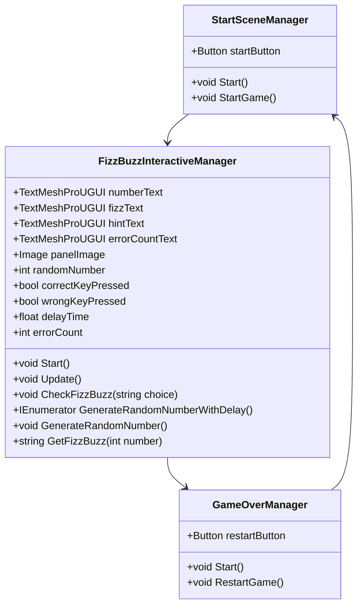

# 13-EndabgabeFizzBuzz-pkrempl

### Einführung und Spielbeschreibung

**FizzBuzz-Spiel**

Das FizzBuzz-Spiel ist ein klassisches mathematisches Spiel, das häufig in Programmierinterviews verwendet wird, um grundlegende Codierungskenntnisse zu testen. Es basiert auf einer einfachen Regel: 

- Für jede Zahl von 1 bis 1000:
  - Wenn die Zahl durch 3 teilbar ist, wird "Fizz" gesagt.
  - Wenn die Zahl durch 5 teilbar ist, wird "Buzz" gesagt.
  - Wenn die Zahl sowohl durch 3 als auch durch 5 teilbar ist, wird "FizzBuzz" gesagt.
  - Wenn die Zahl weder durch 3 noch durch 5 teilbar ist, wird die Zahl selbst gesagt.

**Spielziel**

Das Ziel des Spiels ist es, richtig zu erkennen, ob eine gegebene Zahl durch 3, 5 oder beide teilbar ist oder nicht und die entsprechende Aktion auszuführen.

### Spielanleitung

**Wie man das Spiel spielt**

1. **Spielstart**
   - Beginne das Spiel durch Klicken auf den "Spiel starten"-Button auf der Startseite.

2. **Steuerung**
   - Eine zufällige Zahl zwischen 1 und 1000 wird auf dem Bildschirm angezeigt.
   - Drücke die folgenden Tasten, um deine Antwort zu geben:
     - **Pfeiltaste nach oben**: Wähle diese Taste, wenn die Zahl durch 3 teilbar ist ("Fizz").
     - **Pfeiltaste nach unten**: Wähle diese Taste, wenn die Zahl durch 5 teilbar ist ("Buzz").
     - **Pfeiltaste nach rechts**: Wähle diese Taste, wenn die Zahl sowohl durch 3 als auch durch 5 teilbar ist ("FizzBuzz").
     - **Pfeiltaste nach links**: Wähle diese Taste, wenn die Zahl weder durch 3 noch durch 5 teilbar ist ("Kein FizzBuzz").
   - Wenn deine Antwort richtig ist, wird die Hintergrundfarbe des Panels grün und die entsprechende Antwort (Fizz, Buzz oder FizzBuzz) wird angezeigt.
   - Wenn deine Antwort falsch ist, wird die Hintergrundfarbe des Panels rot und ein Hinweistext erscheint, der die Teilbarkeitsregel(n) erklärt. Drücke die Leertaste, um eine neue Zahl zu generieren und fortzufahren.

**Nutzung von Makey Makey**

Das Spiel kann auch mit dem Makey Makey-Kit gespielt werden, um eine interaktive Spielerfahrung zu bieten.

1. **Setup des Makey Makey**
   - Verbinde das Makey Makey-Kit mit deinem Computer.
   - Verwende Krokodilklemmen, um die Eingänge des Makey Makey mit den gewünschten Tasten auf einem Leiterplattenaufbau oder einem anderen leitfähigen Material zu verbinden.

2. **Belegung der Tasten**
   - Weise die Makey Makey-Tasten wie folgt zu:
     - **Pfeiltaste nach oben**: Klemme an eine leitfähige Oberfläche, die als "Fizz"-Taste dient.
     - **Pfeiltaste nach unten**: Klemme an eine leitfähige Oberfläche, die als "Buzz"-Taste dient.
     - **Pfeiltaste nach rechts**: Klemme an eine leitfähige Oberfläche, die als "FizzBuzz"-Taste dient.
     - **Pfeiltaste nach links**: Klemme an eine leitfähige Oberfläche, die als "Kein FizzBuzz"-Taste dient.
     - **Leertaste**: Klemme an eine leitfähige Oberfläche, die verwendet wird, um nach einer falschen Antwort fortzufahren.
3. **Spielstart mit Makey Makey**
   - Stelle sicher, dass alle Verbindungen fest und korrekt sind.
   - Starte das Spiel wie gewohnt und nutze die Makey Makey-Tasten, um die verschiedenen FizzBuzz-Antworten zu geben und das Spiel zu steuern.

### Zusammenfassung der Fragebogen

**Allgemeine Information**
 - Alter der Tester: 17/16/18
 - Testerfahrung: 1x Anfänger, 2x Fortgeschritten
 **Benutzerfreundlichkeit**
 - 2/3 Befragten fanden das Spiel intuitiv, einer fands gab Mittel an
 - 3/3 Befragten gaben an dass die Anweisungen im Spiel sehr hilfreich waren
**Spielerlebnis**
 - Eine Person gab an dass Sie dass Spiel unterhaltsam fand, einer fand es Mittel und eine fand es langweilig
 - 3/3 Befragten gaben an dass die Anweisungen im Spiel sehr hilfreich waren
 - 2/3 Befragten gaben an dass Sie nicht motiviert wären das Spiel wieder zu spielen, einer gab Mittel an
**Fehlerbehandlung und Feedback**
 - Keiner der Tester haben während des Spielens Fehler oder Abstürze erlebt und konnten somit nicht die folgenden zwei Fragen beantworten
**Verbesserungen und Vorschläge**
 - _Hat gefallen:_
    - Tipps zu den Teilbarkeitsregeln, Anleitung am Anfang
 - _Hat nicht gefallen:_
    - zu wenig Design, man hätte andere Schriftart verwenden können/sollen

# Links
[Mermaid Chart](https://www.mermaidchart.com/app/projects/07313d37-0cf6-4d69-bc10-89d92dbfb2b2/diagrams/374436e4-7712-40f0-a3d6-705cfcb01354/version/v0.1/edit "Mermaid Chart")
[Markdown Cheatsheet](https://github.com/adam-p/markdown-here/wiki/Markdown-Cheatsheet "Markdown Cheatsheet")
